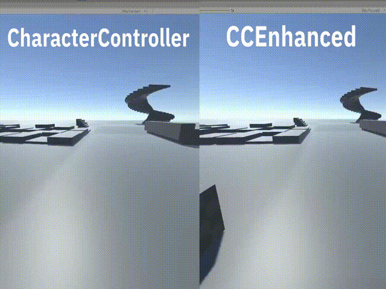

# CCEnhanced2
Component drastically improving step (and other) functionality of CharacterController
## Compatibility
This component is fully compatible with default CharacterController, most scripts can be adapted by simply changing CharacterController reference to CCEnhanced.
## Functionality
### Main and most important feature of CCEnhanced2 is its smooth step capability
This component is capable of smoothly interpolating player's vertical position depending on surrounding geometry, thus removing the need for adding ramp colliders on most obstacles or stairs.



This component works as if there was real smooth geometry around ledges, meaning you can stop midway or walk in circles without any jitter.


Higher quality demonstration of smooth step functionality can be seen on this video: https://www.youtube.com/watch?v=CPj9WfncxWE

### New ground check system
Default CharacterController ground check system works by checking if player tries to penetrate the ground, this results in ground check being false when the dot product of player's velocity and surface normal is >= 0, even if player is on the ground, 
this is a major problem when you want to implement accurate physics.

CCEnhanced2 instead simply checks if player is close to the ground, solving this problem.

Keep in mind that in some cases this might create new issues, for example if player tries to rapidly jump at high framerates or slowed down time they might get multiple jumps, this can be solved by overriding CCEnhanced.isGrounded after performing jump (or any other action that pushes player up)
### Other functionality 
```
CheckHead() - checks for obstacles above player's head, useful for crouching.
```
```
SetHeight() - modifies player's height, directly modifying height of CharacterController is not advised
```
## Parameters
### For quick setup you can reference included example scene
```Collision Mask``` - stores layers that will be ignored, it must include your player, otherwise isGrounded will always be true

```Height``` - height of CharacterController

```Radius``` - radius of CharacterController

```Step Offset``` - max height player can ascend

```Scan Radius``` - distance at which player will start ascending when approaching a ledge

```Ascend Margin``` - margin for ascending player, useful to avoid accidental collision with edges, only useful when player's velocity is modified in OnControllerColliderHit()

```GroundDetectionMargin``` - player's distance from the ground at which isGrounded will be true

```GroundDetectionSphereScale``` - multiplies player's radius used for ground check


